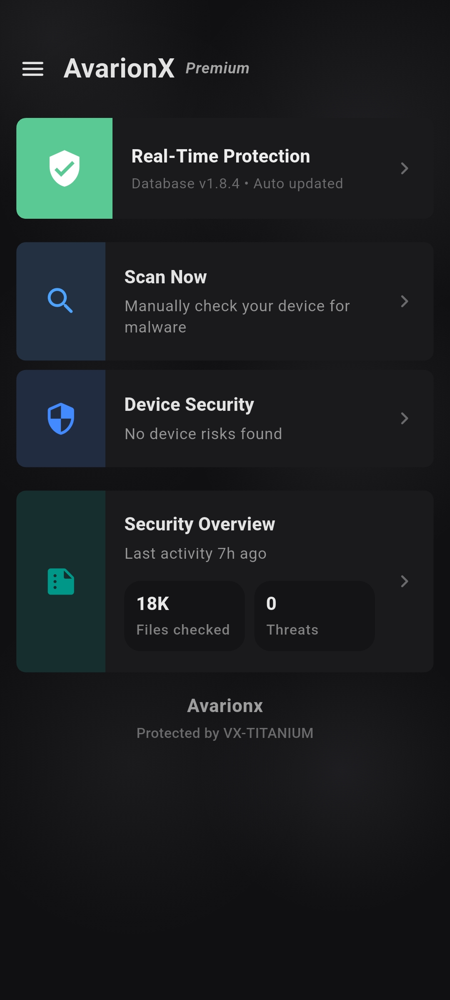
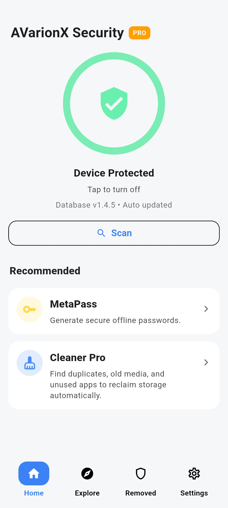
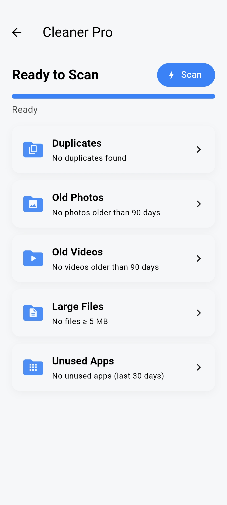
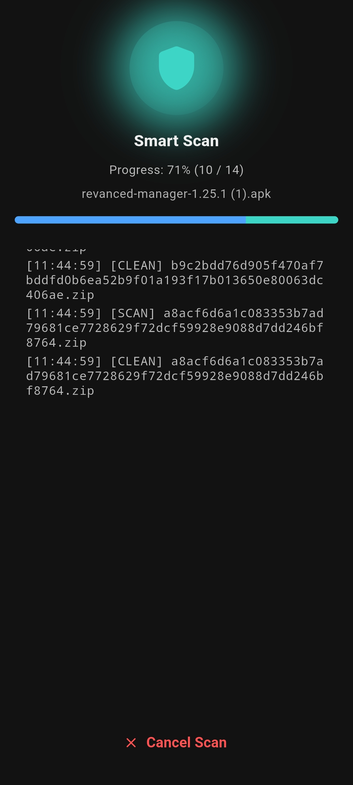
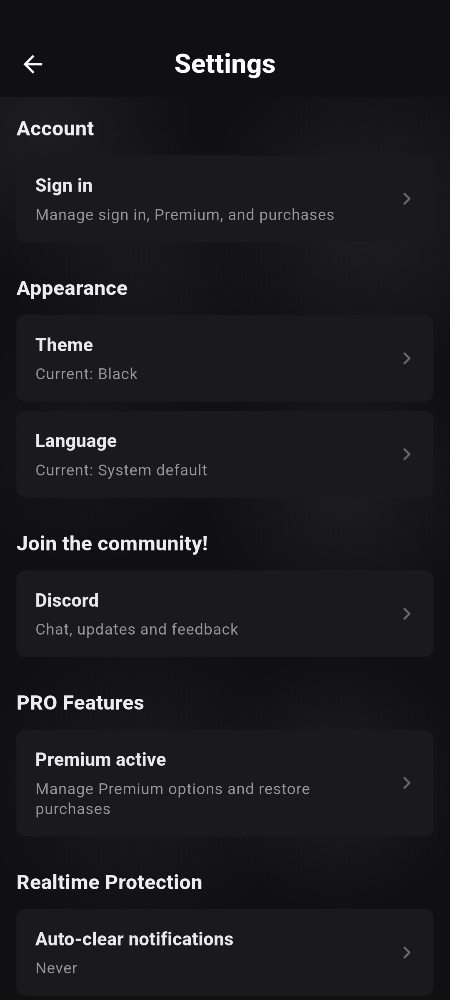

  

# AvarionX Security

### Android malware protection without ads, tracking, or locked core features.

AvarionX combines local malware scanning, optional hash-based cloud intelligence, download monitoring, DNS filtering, APK analysis, and Guardian Mode for ransomware-style behaviour detection.

## What is AvarionX?

AvarionX Security is an Android antivirus built around user privacy.

It can scan files and APKs directly on your device, monitor new downloads, check known malicious domains, and use optional cloud intelligence for hash lookups. The app does not use ads, analytics, or paid protection tiers.

Cloud checks are optional. When enabled, AvarionX sends file hashes for lookup, not the file contents.

## Protection layers

| Layer | What it does |
|---|---|
| **VX-TITANIUM** | Local malware scanning engine for files and APKs. |
| **VTTI Cloud** | Proprietary cloud Intelligence Platform, including hash checking |
| **Real-Time Protection** | Monitors new downloads and recently added files. |
| **Guardian Mode** | Watches for ransomware-style file behaviour. |
| **APK analysis** | Checks installed or selected APKs for suspicious indicators. and creates a detailed report |

## The Engine's Architecture

AvarionX Antivirus (CS Security) operates through a multi-layered detection pipeline powered by VX-Titanium.

1. Cloud Hash Layer: A fast check on an extremely large historical and current corpus of over 200 million unique malware hashes
2. Hash Layer: Comparing both SHA256 and MD5 fingerprints against known malware lists
3. Signature Layer: Custom byte signitures checked against apk containers, dex and native libraries.
4. Heuristic Layer: Machine learning based behaviour analysis for APKs

### Machine Learning (ML+)

AvarionX Security includes a dual ML system named ML+

* On-Device: Runs on-device with no remote processing or user telemetry
* MUniverse Tag: Suspicious applications that meet the scoring system's requirements are dubbed with a MUniverse (Malware Universe) tag

## Guardian Mode

By utilizing shizuku, Guardian Mode can monitor app behaviour that android would normally keep out of reach. When an app starts changing files, AvarionX monitors it, assessing the likelihood on destructive behaviour.
Guardian Mode is currently focused on ransomware-style behaviour. More behaviour categories will be added in future updates.

## Screenshots

<table>
  <tr>
    <td width="20%" align="center">
       
      <strong>Home screen</strong>
    </td>
    <td width="20%" align="center">
       
      <strong>Features list</strong>
    </td>
    <td width="20%" align="center">
       
      <strong>Scanning mode</strong>
    </td>
    <td width="20%" align="center">
       
      <strong>APK Analyser</strong>
    </td>
    <td width="20%" align="center">
       
      <strong>Settings Screen</strong>
    </td>
  </tr>
</table>

## Privacy model

AvarionX is designed to avoid unnecessary data collection.

- No advertisements
- No tracking or analytics
- No HTTPS traffic decryption
- No content inspection
- No file uploads for cloud checks
- Hash-only cloud lookups when VTTI is enabled
- Local scanning works offline

<h2>Guardian Mode Demo</h2>

  

